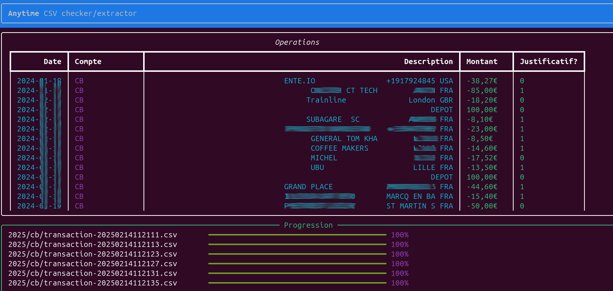

# Anytime Extractor

Ce logiciel m'aide chaque année à préparer les pièces pour ma comptable en utilisant
les csv extraits de l'interface Anytime (banque en ligne Orange).

Aucune garantie n'est fournie !

 

## Comment l'utiliser ?

 - Rassemblez vos CSV de l'année dans un dossier (ex: 2025)
 - Lancez `./archive.py 2025 export-2025`

 Vous obtiendez alors dans `export-2025` des CSV classés par CB/Compte par mois
 et les pièces justificatives téléchargées. Un fichier `justificatifs-manquants.csv` vous
 aidera à savoir ce qu'il manque.
